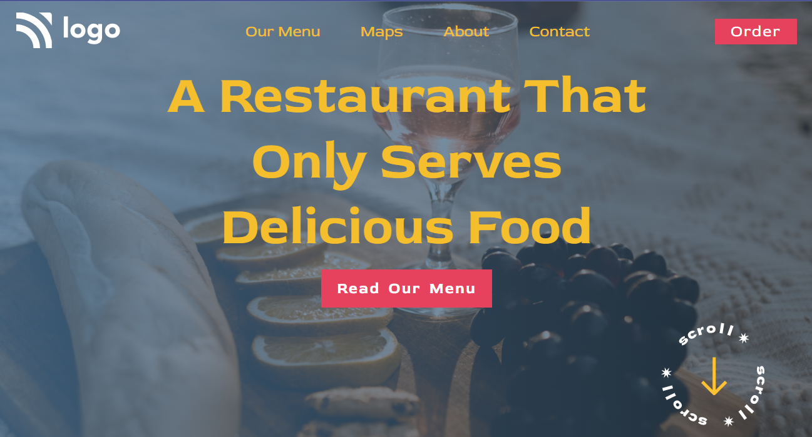

## [DeployedLink](https://restaurant-readourmenu.netlify.app/)
# Restaurant - HTML  and CSS 
By Shiwansh
## Completed Project

## Responsive Design

## What I learned from this project ?
- Flexbox and different flex properties 
- How to use flex-properties like align-items, justify-content, gap, etc.

## Challenges :- 
- Responsiveness
    - *I solved it by modifying values of different properites like padding, margin, font-size, gap, etc. once the media query condition is met.*

# It took me 2:30 hours to complete this project. 
